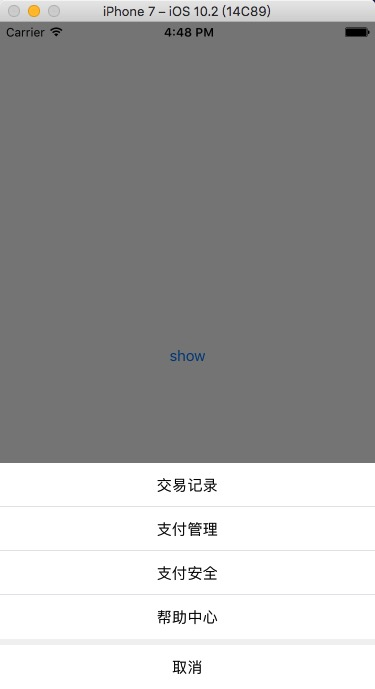
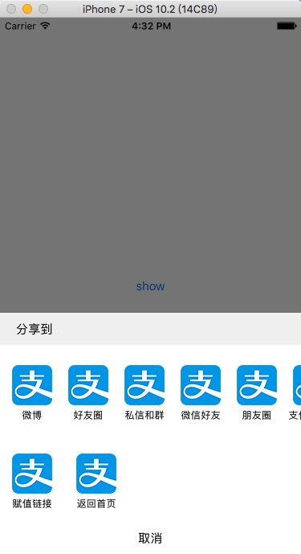
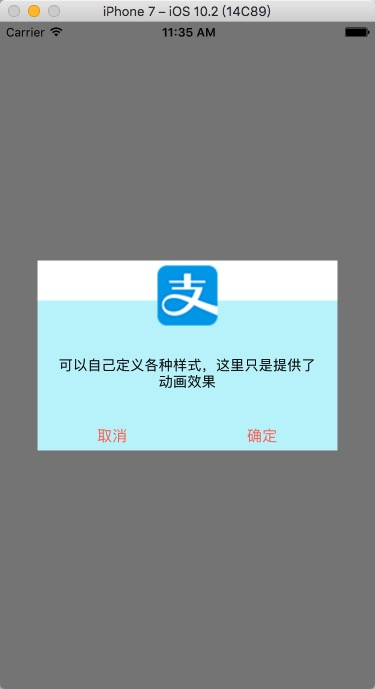

#自定义action
基于UIViewControllerTransitioningDelegate协议，封装了alert和sheet的动画效果，支持屏幕旋转，可以在此基础上自由定制各种不同的页面。
支持：iOS 8+
###自定义sheet
利用转场动画，可根据业务需求个性化定制页面。

使用：
根据UI图，在控制器中写好页面，设置contentsize即可
引入`#import "UIViewController+XELTransition.h"`

调用`[self xel_presentViewController:secondVC completion:NULL];`

dismiss时调用`[self xel_dismissViewControllerCompletion:NULL];`即可

###自定义alert
利用转场动画，可根据业务需求个性化定制页面。目前只写了一种从上到下的动画效果

